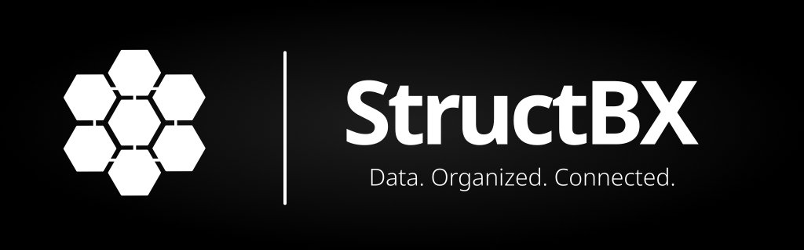

[][homepage]
[][compilers_versions]
[](LICENSE)
====

# StructBX

## Introduction

Hello! Thank you for using this software, developed with a lot of effort and affection for the Free Software community.

## About this software

StructBX is a collaboration tool that combines the ease of use of a spreadsheet with the power of a database.

## Requeriments

On Debian (12):

```shell
apt-get update && apt-get install -y \
      make \
      binutils \
      g++ \
      git \
      cmake \
      libssl-dev \
      libpoco-dev \
      libmariadb-dev \
      libyaml-cpp-dev
```

## Installation

- Download the source code

```shell
git clone https://github.com/structbx/structbx.git
cd structbx
```

- Build and install

```shell
mkdir build && cd build
cmake ../ -DCMAKE_BUILD_TYPE=Release -DCMAKE_INSTALL_PREFIX=/
cmake --build . --parallel $(nproc)
cmake --build . --target install
```

## Using Docker

- Docker pull

```shell
docker pull ghcr.io/structbx/structbx:latest
```

- Docker run

```shell
docker run -t --name structbx-server-docker -p 3001:3001 --init -d structbx:latest
```

## Documentation

**Work in progress!**

## Contact

- **Github**: [@structbx](https://github.com/structbx/)

## License

This project is under licence [Apache-2.0](http://www.apache.org/licenses/LICENSE-2.0) - see file [LICENSE](LICENSE) for more details

[homepage]: https://structbx.github.io/
[compilers_versions]: https://en.cppreference.com/w/cpp/compiler_support