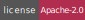
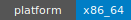
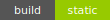
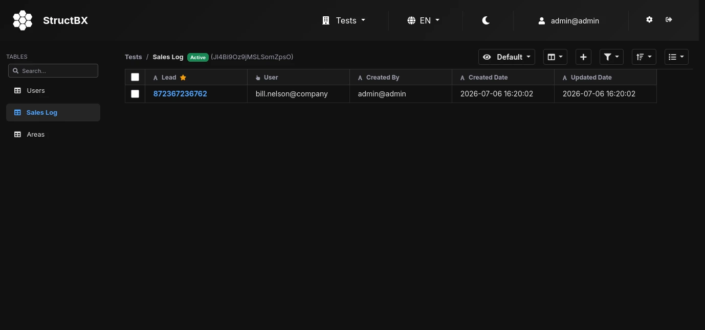
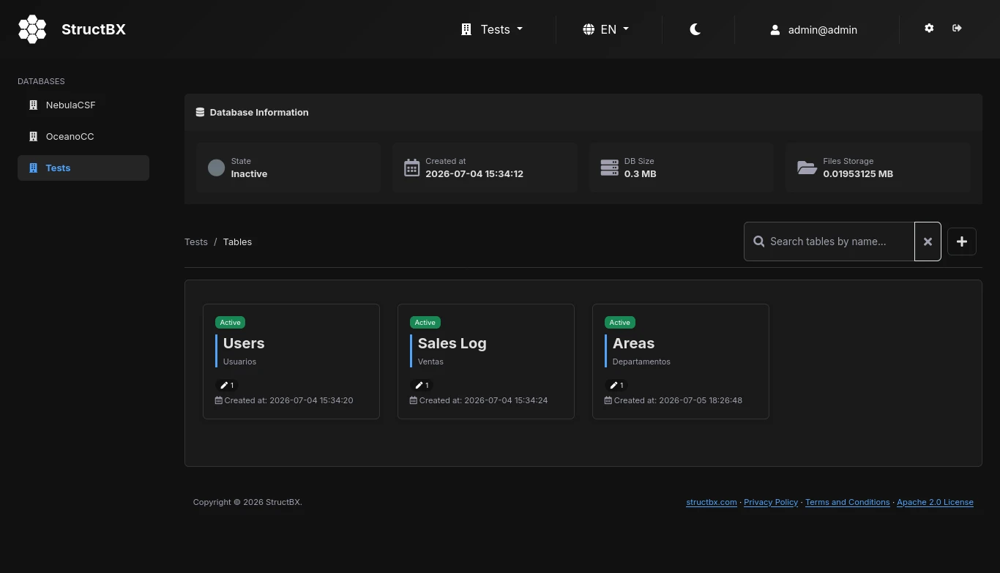

[][homepage]
[][compilers_versions]
[](LICENSE)
[]()
[]()

# StructBX

> StructBX: The compiled database manager.

StructBX is a web-based tool to manage **MariaDB/MySQL** databases directly from your browser. Create, edit, and delete tables, columns, views, forms, and more — through a clean interface without writing SQL.

## Why StructBX?

Unlike similar tools that require a runtime interpreter, **StructBX is a compiled, self-contained binary**. This gives you:

- **Performance** — starts in milliseconds, minimal RAM and CPU usage.
- **Simplicity** — a single `structbx-server` binary. No runtime, no dependencies, no "extras" in production.
- **Security** — reduced attack surface compared to interpreted stacks.
- **Portability** — runs on any Linux x86_64 without additional software.

## Installation

### 1. Binary install (recommended)

```sh
curl -fsSL https://github.com/structbx/structbx/releases/latest/download/install.sh | sh
```

Downloads the static binary and web assets from the latest GitHub release, then configures everything automatically.

> **Requirements:** A Linux x86_64 system with a running MariaDB/MySQL server.

### 2. Docker

```sh
docker pull ghcr.io/structbx/structbx:latest
docker run -d --name structbx -p 3001:3001 ghcr.io/structbx/structbx:latest
```

### 3. Build from source (developers)

```sh
git clone https://github.com/structbx/structbx.git
cd structbx

# Install build dependencies (Debian/Ubuntu)
sudo apt install cmake g++ libpoco-dev libmariadb-dev libyaml-cpp-dev libssl-dev zlib1g-dev

# Build
cmake -S . -B build -DCMAKE_BUILD_TYPE=Release
cmake --build build --parallel $(nproc)

# Install
sudo cmake --install build
```

## Quick start

After installation, edit the configuration file with your database credentials:

```sh
sudo nano /etc/structbx/properties.yaml
# Set db_host, db_port, db_name, db_user, db_password
```

Then start the server:

```sh
sudo structbx-server --config /etc/structbx/properties.yaml
```

Open `https://localhost:3001` in your browser.

## Screenshots




## Documentation

Work in progress.

## Contact

- **GitHub**: [@structbx](https://github.com/structbx/)

## License

This project is licensed under [Apache-2.0](http://www.apache.org/licenses/LICENSE-2.0) — see the [LICENSE](LICENSE) file for details.

[homepage]: https://structbx.github.io/
[compilers_versions]: https://en.cppreference.com/w/cpp/compiler_support
